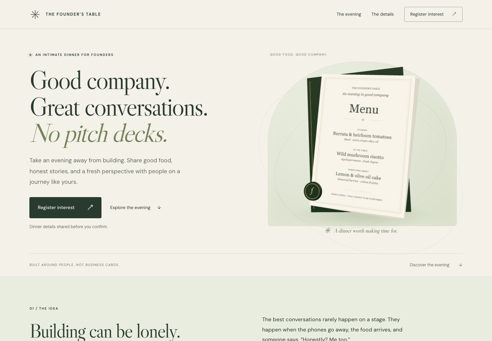

<a id="readme-top"></a>

<div align="center">
  <h1>Vibe Coding Workshop</h1>
  <p>Turn an idea into a runnable app. Inspect it. Verify it.</p>
  <p>
    <a href="#getting-started"><strong>Explore the workshop »</strong></a>
  </p>
  <p>
    <a href="https://vibe-coding-workshop-good.vercel.app">View Demo</a>
    &middot;
    <a href="https://github.com/Ducksss/vibe-coding-workshop/issues/new">Report Bug</a>
    &middot;
    <a href="https://github.com/Ducksss/vibe-coding-workshop/issues/new">Request Feature</a>
  </p>
</div>

<details>
  <summary>Table of Contents</summary>

- [About The Project](#about-the-project)
- [Built With](#built-with)
- [Getting Started](#getting-started)
- [Your First Edit](#your-first-edit)
- [Student Perks](#student-perks)
- [Usage](#usage)
- [Verification](#verification)
- [Repository Map](#repository-map)
- [Deployment](#deployment)
- [Troubleshooting](#troubleshooting)
- [Roadmap](#roadmap)
- [Contributing](#contributing)
- [License](#license)
- [Contact](#contact)
- [Acknowledgments](#acknowledgments)

</details>

## About The Project

A hands-on workshop about turning an idea into a runnable app with an AI coding tool—and checking that the result does what you intended.

Compare two prompts for the same meditation landing page, then explore an iteratively refined founder dinner page with a 3D menu and a working interest form. The lesson is practical: describe success, inspect the result, and verify the behavior before calling it done.

### What you’ll practice

- Translate an idea into an audience, purpose, visual direction, and concrete interactions.
- Separate a convincing interface from a working feature.
- Give focused follow-up instructions after inspecting a first result.
- Check mobile layouts, keyboard controls, reduced motion, and failure states.
- Recognize when a page needs a backend and what happens to submitted data.

### Built With

- **Meditation examples:** React, Tailwind CSS, and Vite.
- **Founder’s Table:** HTML, CSS, JavaScript, Three.js, and Node.js.

See each example’s `package.json` and lockfile for its dependencies.

<p align="right">(<a href="#readme-top">back to top</a>)</p>

## Getting Started

| Example | What you’ll learn | Open it |
| --- | --- | --- |
| **Vague prompt · Still** | What an AI fills in when you leave the requirements open | [Live demo](https://vibe-coding-workshop-bad.vercel.app) · [Setup and source](examples/bad-prompt/README.md) |
| **Specific prompt · Still** | How explicit requirements produce behavior you can check | [Live demo](https://vibe-coding-workshop-good.vercel.app) · [Setup and source](examples/good-prompt/README.md) |
| **Iterative demo · The Founder’s Table** | How visual refinement, accessibility, and server-side storage fit together | [Local setup and prompt](examples/interactive-demo/README.md) |

Follow the examples in order: **bad-prompt → good-prompt → interactive-demo**. Each folder has a `README.md` with its setup and source guide. Start editing in **good-prompt**; keep **bad-prompt** as the original comparison.

New to coding? Start with the two live pages. You can compare their copy, buttons, and mobile layouts without installing anything. To change the examples or run checks, follow the local setup below.

### Prerequisites

You’ll need a browser, a terminal, and an editor. To generate your own versions, use an AI coding tool that can create files and run commands. No particular tool is required; keep the model and settings consistent for the comparison. The supplied apps need no API keys, login, or paid services to run locally.

Install **Node.js 22.12 or newer**, npm, and Git.

### Installation

Clone the repository:

```sh
git clone https://github.com/Ducksss/vibe-coding-workshop.git
cd vibe-coding-workshop
node --version
npm --version
```

Each example is an independent project with its own lockfile. There is no root-level npm app. Run the following from the repository root in **separate terminals**:

```sh
# Terminal 1: vague prompt
cd examples/bad-prompt
npm ci
npm run dev -- --port 5181
```

```sh
# Terminal 2: specific prompt
cd examples/good-prompt
npm ci
npm run dev -- --port 5182
```

```sh
# Terminal 3: iterative demo (optional)
cd examples/interactive-demo
npm ci
npm run dev
```

Open [vague prompt on port 5181](http://localhost:5181), [specific prompt on port 5182](http://localhost:5182), and [Founder’s Table on port 5183](http://localhost:5183). Stop a server with `Ctrl+C`. If Vite selects another port, use the URL printed in that terminal.

Dependency installation needs internet access. The vague example and Founder’s Table also load Google Fonts, with local fallback fonts. Founder’s Table serves Three.js locally after installation.

<p align="right">(<a href="#readme-top">back to top</a>)</p>

## Your First Edit

Start with a small visible change before changing how the app works:

1. Run the specific-prompt example using the installation commands above. Keep that terminal running.
2. In your editor, open `examples/good-prompt/src/main.jsx`. Find `A calmer mind.` inside the heading and change those words. Leave the surrounding tags in place.
3. Save the file and look at the browser. Vite updates the page automatically.
4. Open `examples/good-prompt/src/styles.css` to explore the page’s colors and spacing.
5. Open a second terminal at the repository root and run the checks below. Then click “Start a 1-minute break” in the browser to confirm the exercise still opens.

```sh
npm --prefix examples/good-prompt test
npm --prefix examples/good-prompt run build
```

`cd` changes the terminal’s current folder. `npm ci` installs the dependency versions recorded in `package-lock.json`. `npm run dev` starts the local development server; `npm test` runs automated checks; `npm run build` creates a deployable copy. `--prefix` tells npm which example folder to use without changing your current folder.

For a file-by-file guide, see the [repository map](#repository-map) and the [specific example README](examples/good-prompt/README.md).

## Student Perks

These optional offers can help you build during and after the workshop. **You do not need a paid subscription to run the supplied examples.** Apply ahead of the session so verification does not use up workshop time.

Checked **13 September 2026** against the linked official pages. Availability depends on your institution, age, country, and account; check the current terms before subscribing. The Gemini details below are for **Singapore**.

| Tool / signup link | Student benefit | Eligibility and conditions |
| --- | --- | --- |
| **[GitHub Student Developer Pack](https://education.github.com/pack)** | Free GitHub Pro, Codespaces benefits, Copilot Student, and partner offers | Student verification required. Copilot chat and agent usage is limited. See the application checklist below. |
| **[Gemini for students](https://gemini.google/sg/students/?hl=en)** | Google AI Plus free for 12 months, higher usage limits, and 400 GB storage | Eligible college students aged 18+. Redeem by **31 December 2026**. Payment method required; automatically renews at **S$6.98/month** unless cancelled. |
| **[Lovable for students](https://lovable.dev/students)** | 50% off the Pro 100-credit monthly plan; US$12.50/month discount on other plans | Up to 12 months. Use a student-email account and verify your status **while on the Free plan**. Cancelling loses the discount; regular pricing applies after it expires. |
| **[Figma for Education](https://help.figma.com/hc/en-us/articles/360041061214-Figma-for-Education)** | Free Professional plan; eligible higher-education and bootcamp users also receive AI credits and Figma Make access | Education verification required. AI features are unavailable to high-school/K–12 education users. Bootcamp students must be verified through an approved programme. |
| **[Notion Education](https://www.notion.com/help/notion-for-education)** | Free individual Education plan with unlimited uploads, 30-day history, and up to 100 guests | Accredited college/university email required as your main account email. One workspace member; verify annually. |

### More benefits through GitHub

Once verified, redeem these through the **[Student Developer Pack](https://education.github.com/pack)**. Each partner has its own terms and activation steps.

| Perk | What you can claim | Workshop use |
| --- | --- | --- |
| Appwrite | Two Education projects with Pro-equivalent resource limits while eligible | Explore a hosted app backend |
| Microsoft Azure | US$100 cloud credit plus free services; ages 18+, no credit card required | Try cloud services |
| Namecheap / .TECH | A `.me` domain through Namecheap or a standard `.tech` domain, free for one year | Give a project its own address; check renewal costs |
| Frontend Masters | Six months of free courses and workshops | Keep learning after the session |
| JetBrains | Free student subscription, renewable annually | Use professional coding IDEs |

### Before you arrive

1. **Apply for GitHub Education first.** You must be 13+ and enrolled in a degree- or diploma-granting programme. Prepare your school email and dated proof of enrolment, such as a current student ID, timetable, or enrolment letter. Workshop attendance alone does not qualify. Follow the [official application guide](https://docs.github.com/en/education/about-github-education/github-education-for-students/apply-to-github-education-as-a-student).
2. **Claim the tools you intend to use.** Lovable and Notion require your academic email for their offers. Gemini requires a **personal Google account**, student verification, and a payment method; a school-issued Workspace for Education account cannot redeem it. Read the [Google offer terms](https://one.google.com/offer/studentoffer8?g1_landing_page=0).
3. **Record trial end dates and renewal prices.** Set a reminder before any free or discounted subscription becomes paid or returns to regular pricing.

### For workshop organisers

Lovable's [school-event announcement](https://lovable.dev/blog/back-to-school-discount) lists **sophia@lovable.dev** as a contact for school hackathons. Ask whether your workshop qualifies for event support or credits; these are not guaranteed. Universities can also enquire about academic Business-plan pricing with shared credits through the [student page](https://lovable.dev/students).

Cursor's [current student page](https://cursor.com/students) points to campus and online event promotions. Do not assume the older “one year of Pro free” offer is still available.

<p align="right">(<a href="#readme-top">back to top</a>)</p>

## Usage

### Run the workshop

Suggested duration: **60 minutes**. Work individually or in pairs.

| Time | Activity | Result |
| --- | --- | --- |
| 0–5 min | Open both supplied meditation pages; predict which prompt produced each | Initial observations |
| 5–15 min | Create two fresh projects with the same model/settings; paste one prompt into each | Two independent first attempts |
| 15–30 min | Run both results and use the review checklist below | Evidence of what works and what is missing |
| 30–40 min | Choose one gap and write a focused follow-up prompt; rerun the relevant checks | One verified improvement |
| 40–50 min | Explore Founder’s Table: inspect the 3D menu, mobile layout, and form | Understand the difference between UI and stored data |
| 50–60 min | Share the original prompt, change, and verification evidence | A short explanation of what improved and why |

Keep the initial outputs before refining them, and record the model/settings and follow-up prompts. If time or installation is limited, use the supplied examples and spend the generation time on inspection instead.

Facilitator questions:

- Which decisions did your prompt specify, and which did the model invent?
- Which parts looked complete until you clicked them?
- What evidence would convince another person that the feature works?
- Which follow-up instruction removed the most ambiguity?

### The examples, side by side

| | Vague prompt | Specific prompt |
| --- | --- | --- |
| Desktop |  |  |
| Mobile | [375px screenshot](output/playwright/bad-mobile.png) | [375px screenshot](output/playwright/good-mobile.png) |
| Session action | Scrolls to session cards and shows placeholder feedback | Opens and starts a 60-second breathing exercise |
| Behavior | Session cards show a message; no audio player or working session | Pause, resume, reset, five-second breathing cues, and completion state |
| Stack | React, Tailwind CSS, Vite | React, Tailwind CSS, Vite |
| Backend | None | None |

[View the breathing exercise](output/playwright/good-session.png). Desktop captures use a 1440px viewport. These are saved previews, not a live deployment status check.

#### How to interpret the comparison

“Bad” describes the prompt’s lack of detail, not the visual quality of the result. A vague prompt can still produce an attractive page. Missing requirements in that version are decisions left to the AI, not failures to follow the prompt.

Both meditation examples were generated in separate tasks using **GPT-5.6 Terra with high reasoning effort**. The vague version remains as generated. The specific version received a follow-up visual refinement at the instructor’s request, so the current pages are **not a controlled one-shot comparison**. The original specific version is preserved in commit `38d2bbc`.

Results vary between runs. Judge the output against the requirements you actually supplied. Marketing figures in the vague example are invented demo content, not verified claims. Neither example is a production meditation product.

### Bad prompt — vague

```text
Build a landing page for a meditation app using React and Tailwind.
Make it look nice and modern. Add some animations.
```

### Good prompt — specific and testable

```text
Build a responsive landing page for “Still,” a meditation app for busy
students who want a short break between classes. Use React and Tailwind.

Make it feel calm and uncluttered: warm cream background, soft sage-green
accents, dark readable text, generous spacing, and gentle animations.

Include:
- A simple navigation bar with the app name and a “Try a session” button.
- A hero section with the headline “A calmer mind, one minute at a time,”
  a short supporting sentence, and a “Start a 1-minute break” button.
- An animated breathing circle beside the headline.
- Three benefits: refocus between classes, unwind after studying, and
  build a daily habit.
- A simple footer.

Make both buttons open a breathing exercise with a 60-second countdown,
alternating “Breathe in” and “Breathe out” every five seconds. Include
start, pause, and reset controls, plus a completion message.

On mobile, stack the text above the breathing circle. Support keyboard
navigation and reduced-motion preferences. No login, backend, or paid services.

Build the complete runnable page and include setup instructions. Verify
that the buttons work, the timer pauses and resets correctly, and the
mobile layout has no horizontal overflow.
```

### Review the results

Use this checklist on the specific-prompt result. Record pass/fail and a short observation; a screenshot alone cannot prove an interaction works.

| Check | How to verify |
| --- | --- |
| Audience | Confirm the copy addresses busy students taking short breaks. |
| Visual direction | Look for cream, sage-green accents, readable text, and generous spacing. |
| Entry points | Click each session button separately; both should open and start the exercise. |
| Pause and resume | Pause, wait a few seconds, and confirm the count stays fixed; resume and confirm it continues. |
| Reset | Reset mid-session; expect 60 seconds and a stopped timer. |
| Breathing cues | Watch a running session change from “Breathe in” to “Breathe out” after five seconds. |
| Completion | Let the full minute finish; confirm zero, a completion message, and no negative countdown. |
| Mobile | Check at 375px: text above the circle, readable controls, no horizontal overflow. |
| Keyboard | Reach and activate controls with Tab and Enter/Space; inspect focus when opening and closing the dialog. |
| Reduced motion | Enable reduced motion in your OS or browser developer tools and inspect animation behavior. |

The supplied good example’s automated test checks the breathing-phase helper. It does **not** establish full timer UI or accessibility correctness. The dialog does not currently trap focus or restore focus to its opener, and the countdown uses browser intervals, which can be delayed in background tabs. These are useful review findings, not production guarantees.

#### Write a useful follow-up

Use an observed problem, an expected result, and a check:

```text
On the breathing dialog, Tab moves focus into the page behind it.
Keep keyboard focus inside the open dialog, support Escape to close it,
and return focus to the button that opened it. Preserve the timer behavior.
Verify the complete interaction using only the keyboard and rerun the
existing timer test and production build.
```

For a new idea, start with this reusable structure:

```text
Build [product] for [audience] so they can [primary outcome].
Use [stack and constraints].
Include [sections and content] with [visual direction].
When the user [action], the app should [observable result].
Handle [empty, loading, error, and completion states that apply].
Support [mobile layout, keyboard use, and reduced motion].
Do not add [out-of-scope features].
Provide setup instructions and verify [specific acceptance checks].
```

### Iterative demo — The Founder’s Table

A founder dinner interest page built with HTML, CSS, JavaScript, Three.js, and a small Node.js server. It combines a dimensional dinner menu, pointer movement, scroll parallax, responsive layouts, and an interest form that saves to a private local JSONL file. There is no build step.



[Mobile preview](examples/interactive-demo/previews/mobile.png) · [Improved prompt, storage details, and browser checks](examples/interactive-demo/README.md)

Use fictional details in class. A successful form submission creates a real record in `examples/interactive-demo/data/interest.jsonl` by default. It does not send an email, reserve a seat, or take payment. Testimonials, event totals, and menu dishes are visibly marked as samples. The demo runs locally; the meditation deployment links do not host this server.

<p align="right">(<a href="#readme-top">back to top</a>)</p>

## Verification

Run these from the repository root after installing each example’s dependencies:

```sh
npm --prefix examples/bad-prompt run build
npm --prefix examples/good-prompt test
npm --prefix examples/good-prompt run build
npm --prefix examples/interactive-demo test
```

| Check | Coverage |
| --- | --- |
| Meditation production builds | Bundling and asset compilation; not browser behavior |
| Good example `npm test` | Five-second phase boundaries and completion at zero |
| Founder’s Table `npm test` | Real API validation, persistence, origin rejection, oversized requests, private-data route rejection, and local Three.js routes |
| Founder’s Table browser check | WebGL rendering, parallax, reduced motion, five viewport widths, sample labels, FAQ, invalid form submission, and input preservation after a request failure |

The API test uses a temporary directory and removes it afterward; it does not write to the classroom interest list. The browser check requires a running server and a browser; see [its commands](examples/interactive-demo/README.md#verification-and-sample-content). The vague example has no automated test script. Use the manual checklist for browser behavior.

<p align="right">(<a href="#readme-top">back to top</a>)</p>

## Repository Map

```text
README.md                 Start here: setup, prompts, and workshop activities
examples/                 Three independent apps; run npm inside one of these
  bad-prompt/             Lesson 1: vague prompt and placeholder interactions
    README.md             Setup, limitations, and checks
    index.html            Browser entry point; loads src/main.jsx
    src/main.jsx          React page content and interactions
    src/style.css         Page styling
  good-prompt/            Lesson 2: specific prompt and breathing exercise
    README.md             Setup, source guide, and checks
    index.html            Browser entry point; loads src/main.jsx
    src/main.jsx          React page, dialog, and countdown state
    src/styles.css        Page styling
    src/timer.js          Breathing-phase helper
    test/timer.test.mjs   Automated helper check
  interactive-demo/       Lesson 3: iterative design and saved form submissions
    README.md             Setup, source guide, and API details
    index.html            Page content and form
    style.css             Page styling
    app.js                Browser interactions and form requests
    scene.js              Three.js menu rendering
    server.mjs            Serves the page and saves POST /api/interest
    test.mjs              Automated API check
    browser-check.js      Browser checks
    previews/             Saved desktop and mobile screenshots
output/                   Presentation decks and saved workshop images
  *.pptx                  Slide deck versions; not required to run the apps
  playwright/             Screenshots, including earlier design iterations
```

### Files shared by convention

Each example has its own `package.json` (dependencies and runnable commands) and `package-lock.json` (exact dependency versions). The React examples also have `vite.config.js` for their development/build tooling. The apps do not import code from one another, so you can study one folder at a time.

The React pages start at `index.html`, which loads `src/main.jsx`; React then draws the page. In Founder’s Table, `server.mjs` serves `index.html`, and the browser loads `style.css` and `app.js`. The form sends data back to the server; `scene.js` handles the optional 3D visual.

### Generated files versus source files

Edit the source files listed above. `node_modules/` contains installed dependencies and `dist/` contains generated production builds; both are ignored by Git and should not be edited. Founder’s Table creates private `data/interest.jsonl` records when its form is submitted; that directory is also ignored. `output/` and `previews/` are saved reference material, not application source.


<p align="right">(<a href="#readme-top">back to top</a>)</p>

## Deployment

The meditation apps are separate Vercel projects. Their existing deployment workflow is manual: run `vercel deploy --prod` from the appropriate example folder with the correct Vercel project linked. A Git push alone does not publish an update in this workflow. Each app builds with `npm run build` and outputs static files to `dist/`; `npm run preview` serves that build locally for inspection.

Founder’s Table needs its Node.js API and persistent writable storage. Uploading only its HTML/CSS/JS will not save registrations. Its server binds to `127.0.0.1`; public hosting needs suitable reverse-proxy routing, HTTPS, and the operational preparation described in [the demo README](examples/interactive-demo/README.md#interest-list).

<p align="right">(<a href="#readme-top">back to top</a>)</p>

## Troubleshooting

| Problem | What to do |
| --- | --- |
| npm cannot find `package.json` | Change into an example folder, or use the `npm --prefix` commands above. |
| Vite reports an unsupported Node version | Check `node --version`; use Node.js 22.12 or newer, then rerun `npm ci`. |
| A port is already in use | Stop the other server, or choose a different Vite `--port`. For Founder’s Table, run `PORT=5184 npm run dev`. Its supplied browser check expects port 5183. |
| Dependencies are missing | Run `npm ci` in that example folder. Each example installs separately. |
| The page looks different offline | Google Fonts may be unavailable; fallback fonts are expected. Install dependencies while online first. |
| Founder’s Table shows a flat menu | The CSS fallback is intentional when WebGL is unavailable. Check browser GPU support to inspect the 3D version. |
| The interest form cannot save | Use the Node server, inspect its terminal, and ensure its data directory is writable. A static preview cannot handle the API. |
| A session card only shows a message | This is the vague example’s placeholder behavior; use the specific example for the timer. |

<p align="right">(<a href="#readme-top">back to top</a>)</p>

## Roadmap

- [x] Vague and specific prompt examples with live demos.
- [x] Iterative 3D demo with local form persistence.
- [x] Workshop agenda, review checklist, and verification commands.
- [x] Student perks with signup links and eligibility notes.

Propose future lessons or report gaps through [project issues](https://github.com/Ducksss/vibe-coding-workshop/issues).

<p align="right">(<a href="#readme-top">back to top</a>)</p>

## Contributing

Keep changes focused on the lesson they demonstrate. Include the prompt or reason for a change, update the relevant setup notes, run the applicable checks, and refresh screenshots when the documented appearance changes. Preserve the vague example’s teaching baseline unless the comparison itself is intentionally being revised. Never commit the local interest list or present sample figures as real results.

1. Fork the repository and create a branch for your change.
2. Make the change and run the relevant [verification checks](#verification).
3. Open a pull request describing the teaching purpose, changes, and validation.

For documentation changes, check links, anchors, and commands. For app changes, run the relevant tests and builds and inspect the affected browser behavior.

<p align="right">(<a href="#readme-top">back to top</a>)</p>

## License

No project license file is currently included in this repository.

<p align="right">(<a href="#readme-top">back to top</a>)</p>

## Contact

**Maintainer:** [Ducksss](https://github.com/Ducksss)

For workshop questions and feedback, use [project issues](https://github.com/Ducksss/vibe-coding-workshop/issues).

<p align="right">(<a href="#readme-top">back to top</a>)</p>

## Acknowledgments

- [Best-README-Template](https://github.com/othneildrew/Best-README-Template) by othneildrew — README structure.
- [GitHub Education](https://education.github.com/pack), [Lovable](https://lovable.dev/students), [Google Gemini](https://gemini.google/sg/students/?hl=en), [Figma](https://help.figma.com/hc/en-us/articles/360041061214-Figma-for-Education), and [Notion](https://www.notion.com/help/notion-for-education) — official student-offer information.

<p align="right">(<a href="#readme-top">back to top</a>)</p>
