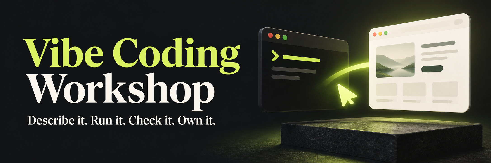
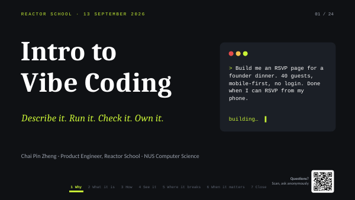
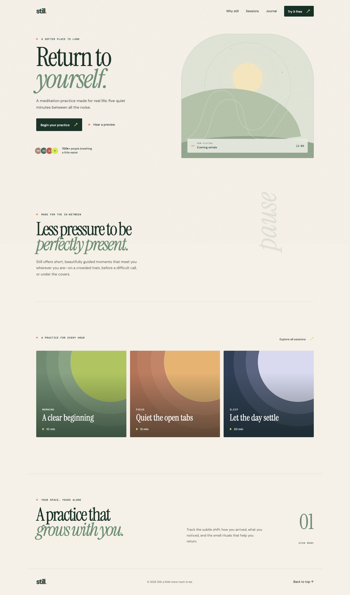
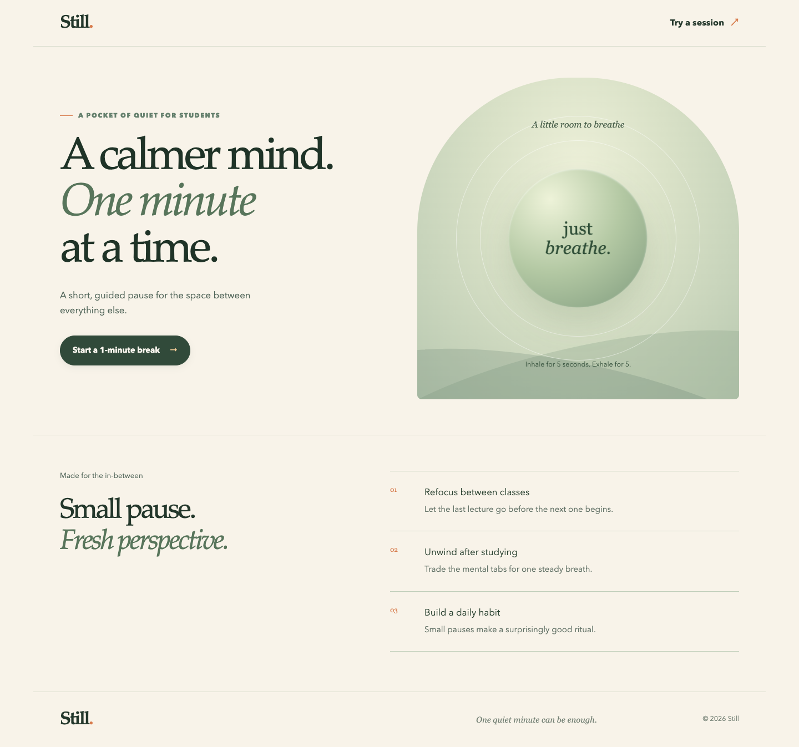

# Vibe Coding Workshop



[](slides.pdf)
[](#example-1--bad-prompt)
[](#student-perks)
[](https://github.com/Ducksss/vibe-coding-workshop)
[](https://github.com/Ducksss/vibe-coding-workshop/issues/new)

Turn an idea into a working app with AI, then check that it actually works.

**Start with the slides, then follow examples 1 → 2 → 3.** You can explore the first two demos in your browser without installing anything.

## Workshop landing page

**[Open the workshop website](https://vibe-coding-workshop-nine.vercel.app)** · [Source and local preview](landing-page/README.md) · [Brand guide](landing-page/BRAND.md)

A premium workshop page featuring an original animated sculpture processed with ASCII Magic, interactive video controls, and a visual branding guide.

## Slides

**[Open the slides (PDF)](slides.pdf)** · [Download the PowerPoint](slides.pptx)

[](slides.pdf)

## Example 1 — Bad prompt

See what an AI builds when the instructions are vague. The page looks convincing, but the session buttons show placeholder messages.

**[Try example 1 — live demo](https://vibe-coding-workshop-bad.vercel.app)** · [Example 1 — prompt, code, and setup](example-1-bad-prompt/README.md)

```text
Build a landing page for a meditation app using React and Tailwind.
Make it look nice and modern. Add some animations.
```

**Try it:** click the session buttons. What did you expect, and what actually happened?

## Example 2 — Good prompt

Compare a more specific prompt for the same meditation app. This version has a working one-minute breathing exercise with pause, resume, and reset.

**[Try example 2 — live demo](https://vibe-coding-workshop-good.vercel.app)** · [Example 2 — prompt, code, and setup](example-2-good-prompt/README.md)

**Try it:** start a session, pause it, and reset it. Resize the page to a phone width. Does the result meet the prompt?

<details>
<summary>Compare the screenshots</summary>

| Example 1 | Example 2 |
| --- | --- |
|  |  |
| [Mobile preview](example-1-bad-prompt/mobile.png) | [Mobile preview](example-2-good-prompt/mobile.png) |

[See the breathing exercise](example-2-good-prompt/session.png). These are saved screenshots.

</details>

“Bad” means vague instructions, not bad-looking design. Both examples used GPT-5.6 Terra with high reasoning effort. Example 2 also received a visual follow-up, so this is not a controlled one-shot comparison. See the [comparison notes](workshop-guide.md#how-to-interpret-the-comparison).

## Example 3 — Improve it step by step

Explore The Founder’s Table: a dinner page refined through follow-up prompts, with a 3D menu and a form that saves submissions locally.

**[Example 3 — prompt, code, and local setup](example-3-iterative-demo/README.md)** · [Example 3 — desktop preview](example-3-iterative-demo/desktop.png) · [Example 3 — mobile preview](example-3-iterative-demo/mobile.png)

**Try it:** inspect the menu, resize the page, and submit fictional details. The form saves a real local record; it does not send an email or reserve a seat. Quotes, event totals, and menu dishes are sample content.

## Run an example on your laptop

Install **Node.js 22.12 or newer**, npm, and Git. You will also need an editor and a terminal. No API key, login, or paid service is needed to run these examples.

Clone this repository once:

```sh
git clone https://github.com/Ducksss/vibe-coding-workshop.git
cd vibe-coding-workshop
```

Start with **example 2** for your first edit:

```sh
cd example-2-good-prompt
npm ci
npm run dev -- --port 5182
```

Open the URL printed in the terminal, normally [localhost:5182](http://localhost:5182). Keep the terminal running. Stop it with `Ctrl+C`.

To run another example, open a new terminal at the repository root and follow that folder’s README:

| Folder | What it contains |
| --- | --- |
| [example-1-bad-prompt](example-1-bad-prompt/README.md) | Vague prompt and the original generated app |
| [example-2-good-prompt](example-2-good-prompt/README.md) | Specific prompt and a working breathing exercise |
| [example-3-iterative-demo](example-3-iterative-demo/README.md) | Follow-up prompt, 3D dinner page, and local form storage |

`cd` changes folders. `npm ci` installs dependencies. `npm run dev` starts the app. Each example is independent; run npm commands inside the example you are using.

### Make your first edit

1. Open `example-2-good-prompt/src/main.jsx` in your editor.
2. Find `A calmer mind.` and change those words, keeping the surrounding tags.
3. Save and look at your browser—the page updates automatically.
4. Click “Start a 1-minute break” to check the exercise still works.
5. Open a second terminal in `example-2-good-prompt` and run:

```sh
npm test
npm run build
```

Use `src/styles.css` to change colors and spacing. Keep example 1 as the comparison baseline. The automated test checks the breathing-phase helper; it does not prove the full timer UI or accessibility. Use the [review checklist](workshop-guide.md#review-the-results) to check behavior.

## Student perks

These optional offers can help you build during and after the workshop. **You do not need a paid subscription to run the supplied examples.** Apply ahead of the session so verification does not use up workshop time.

Checked **13 September 2026** against the linked official pages. Availability depends on your institution, age, country, and account; check the current terms before subscribing. The Gemini details below are for **Singapore**.

| Tool / signup link | Student benefit | Eligibility and conditions |
| --- | --- | --- |
| **[GitHub Student Developer Pack](https://education.github.com/pack)** | Free GitHub Pro, Codespaces benefits, Copilot Student, and partner offers | Student verification required. Copilot chat and agent usage is limited. See the application checklist below. |
| **[Gemini for students](https://gemini.google/sg/students/?hl=en)** | Google AI Plus free for 12 months, higher usage limits, and 400 GB storage | Eligible college students aged 18+. Redeem by **31 December 2026**. Payment method required; automatically renews at **S$6.98/month** unless cancelled. |
| **[Lovable for students](https://lovable.dev/students)** | 50% off the Pro 100-credit monthly plan; US$12.50/month discount on other plans | Up to 12 months. Use a student-email account and verify your status **while on the Free plan**. Cancelling loses the discount; regular pricing applies after it expires. |
| **[Figma for Education](https://help.figma.com/hc/en-us/articles/360041061214-Figma-for-Education)** | Free Professional plan; eligible higher-education and bootcamp users also receive AI credits and Figma Make access | Education verification required. AI features are unavailable to high-school/K–12 education users. Bootcamp students must be verified through an approved programme. |
| **[Notion Education](https://www.notion.com/help/notion-for-education)** | Free individual Education plan with unlimited uploads, 30-day history, and up to 100 guests | Accredited college/university email required as your main account email. One workspace member; verify annually. |

<details>
<summary>More GitHub perks and signup steps</summary>

### More benefits through GitHub

Once verified, redeem these through the **[Student Developer Pack](https://education.github.com/pack)**. Each partner has its own terms and activation steps.

| Perk | What you can claim | Workshop use |
| --- | --- | --- |
| Appwrite | Two Education projects with Pro-equivalent resource limits while eligible | Explore a hosted app backend |
| Microsoft Azure | US$100 cloud credit plus free services; ages 18+, no credit card required | Try cloud services |
| Namecheap / .TECH | A `.me` domain through Namecheap or a standard `.tech` domain, free for one year | Give a project its own address; check renewal costs |
| Frontend Masters | Six months of free courses and workshops | Keep learning after the session |
| JetBrains | Free student subscription, renewable annually | Use professional coding IDEs |

### Before you arrive

1. **Apply for GitHub Education first.** You must be 13+ and enrolled in a degree- or diploma-granting programme. Prepare your school email and dated proof of enrolment, such as a current student ID, timetable, or enrolment letter. Workshop attendance alone does not qualify. Follow the [official application guide](https://docs.github.com/en/education/about-github-education/github-education-for-students/apply-to-github-education-as-a-student).
2. **Claim the tools you intend to use.** Lovable and Notion require your academic email for their offers. Gemini requires a **personal Google account**, student verification, and a payment method; a school-issued Workspace for Education account cannot redeem it. Read the [Google offer terms](https://one.google.com/offer/studentoffer8?g1_landing_page=0).
3. **Record trial end dates and renewal prices.** Set a reminder before any free or discounted subscription becomes paid or returns to regular pricing.

</details>

<details>
<summary>For workshop organisers</summary>


Lovable's [school-event announcement](https://lovable.dev/blog/back-to-school-discount) lists **sophia@lovable.dev** as a contact for school hackathons. Ask whether your workshop qualifies for event support or credits; these are not guaranteed. Universities can also enquire about academic Business-plan pricing with shared credits through the [student page](https://lovable.dev/students).

Cursor's [current student page](https://cursor.com/students) points to campus and online event promotions. Do not assume the older “one year of Pro free” offer is still available.

</details>

## Where everything lives

```text
cover.png                    Workshop cover image
slides.pdf                   Open this first
slides.pptx                  Editable slide deck
example-1-bad-prompt/         First example
example-2-good-prompt/        Second example; start editing here
example-3-iterative-demo/     Third example
workshop-guide.md            Agenda, review checklist, and facilitator notes
archive/                     Older decks and design screenshots
```

Each example opens with its own README, prompt, and setup instructions. `node_modules/` and `dist/` are generated files; edit the source files instead.

## More help

[Workshop agenda](workshop-guide.md#run-the-workshop) · [Troubleshooting](workshop-guide.md#troubleshooting) · [Verification](workshop-guide.md#verification) · [Contributing](workshop-guide.md#contributing) · [Ask a question on GitHub](https://github.com/Ducksss/vibe-coding-workshop/issues/new) · [Browse GitHub issues](https://github.com/Ducksss/vibe-coding-workshop/issues)

README structure adapted from [Best-README-Template](https://github.com/othneildrew/Best-README-Template), arranged in workshop order. [License information](workshop-guide.md#license).
